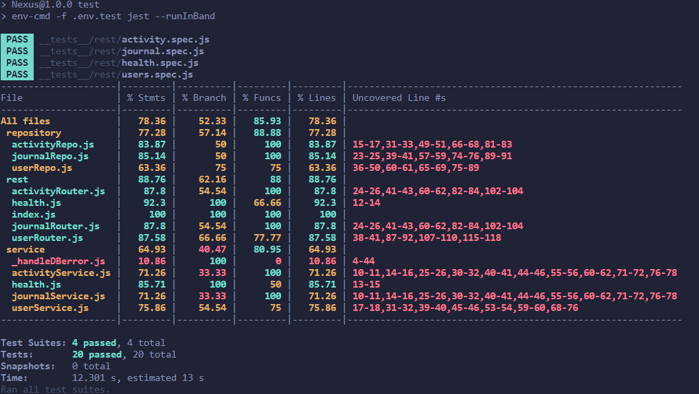

# Bilal Zardoa (202293826)

- [ ] Web Services:
  - <https://github.com/Web-IV/2324-webservices-bilalzardoa>
  - <https://webservices-nexus.onrender.com>

**Logingegevens**

- Gebruikersnaam: admin
- Wachtwoord: admin12345

## Projectbeschrijving

mijn app is een geestelijke gezondheid tracker. De gebruiker logt zijn activiteiten en schrijft in een dagelijks dagboek en met deze gegevens word er advies gegeven op basis van de relatie tussen de activiteit en dagboek (advies nog niet geimplementeerd). EERD =>  

## API calls

### users

- `GET /api/user/users`: alle gebruikers ophalen
- `GET /api/user/count`: aantal gebruikers ophalen
- `GET /api/user/:id`: gebruiker met een bepaald id ophalen
- `GET /api/user/email/:email`: gebruiker met een bepaald email ophalen
- `GET /api/user/username/:username`: gebruiker met een bepaald username ophalen

- `POST /api/user/login`: gebruiker kan inloggen
- `POST /api/user/register`: gebruiker kan registreren

- `DELETE /api/user/delete/:id`: gebruiker kan zichzelf verwijderen met zijn/haar id

### journal

- `GET /api/journal/add`: journal entry toevoegen 
- `PUT /api/journal/user/:id/:journalId`: journal entry bijwerken
- `GET /api/journal/user/:id`: journal entry van een bepaalde gebruiker opvragen met userId
- `GET /api/journal/user/:id/:journalId`: journal entry opvragen adhv journalId

- `DELETE /api/journal/user/:id/:journalId`: journal entry verwijderen 

### activity

- `GET /api/activity/add`: activity entry toevoegen 
- `PUT /api/activity/user/:id/:activityId`: activity entry bijwerken
- `GET /api/activity/user/:id`: activity entry van een bepaalde gebruiker opvragen met userId
- `GET /api/activity/user/:id/:activityId`: activity entry opvragen adhv journalId

- `DELETE /api/activity/user/:id/:activityId`: activity entry verwijderen 

## Behaalde minimumvereisten

### Web Services

- **datalaag**

  - [x] voldoende complex (meer dan één tabel, 2 een-op-veel of veel-op-veel relaties)
  - [x] één module beheert de connectie + connectie wordt gesloten bij sluiten server
  - [x] heeft migraties - indien van toepassing
  - [x] heeft seeds
 

- **repositorylaag**

  - [x] definieert één repository per entiteit (niet voor tussentabellen) - indien van toepassing
  - [x] mapt OO-rijke data naar relationele tabellen en vice versa - indien van toepassing
 

- **servicelaag met een zekere complexiteit**

  - [x] bevat alle domeinlogica
  - [x] bevat geen SQL-queries of databank-gerelateerde code
 

- **REST-laag**

  - [x] meerdere routes met invoervalidatie
  - [x] degelijke foutboodschappen
  - [x] volgt de conventies van een RESTful API
  - [x] bevat geen domeinlogica
  - [x] geen API calls voor entiteiten die geen zin hebben zonder hun ouder (bvb tussentabellen)
  - [x] degelijke authorisatie/authenticatie op alle routes
 

- **algemeen**

  - [x] er is een minimum aan logging voorzien
  - [x] een aantal niet-triviale integratietesten (min. 1 controller >=80% coverage)
  - [x] minstens één extra technologie
  - [x] maakt gebruik van de laatste ES-features (async/await, object destructuring, spread operator...)
  - [x] duidelijke en volledige README.md
  - [x] volledig en tijdig ingediend dossier en voldoende commits

## Projectstructuur

### Web Services

> Hoe heb je jouw applicatie gestructureerd (mappen, design patterns...)?

In de root hebben we een _tests_ folder , config folder en andere nodige bestanden.
De applicatie zit in de "app" folder met daarin de volgende mappen: "src" > "core" , "data","repository","rest","service". Applicatie word gestart in de index.js bestand dat gebruikt maakt van CreateServer.js  .

## Extra technologie

### Web Services

Als extra technologie heb ik gebruik gemaakt van passport.js voor authenticatie.Passport.js maakt gebruik van JWT's om gebruiker informatie op te halen en adhv van passport strategies na te kijken of de JWT van de gebruiker authorisatie heeft.

link naar de npm package =>  https://www.npmjs.com/package/passport

## Testresultaten

### Web Services

> Schrijf hier een korte oplijsting en beschrijving van de geschreven testen + voeg een screenshot van de coverage en uitvoering toe

# activity.spec
In de gegeven code worden Jest-testgevallen geïmplementeerd met behulp van Supertest om HTTP-verzoeken in een Node.js-toepassing te testen. Deze tests dekken verschillende functionaliteiten met betrekking tot gebruikersactiviteiten, zoals het toevoegen, bijwerken, ophalen en verwijderen van activiteitsvermeldingen. De testgevallen omvatten ook scenario's om de behandeling van ongeldige of ontbrekende gegevens te verifiëren bij interactie met de `/api/activity` eindpunten, waarmee de robuustheid van de activiteitsgerelateerde functionaliteiten van de applicatie wordt gegarandeerd.

# journal.spec
In de verstrekte code worden Jest-testgevallen geïmplementeerd met behulp van Supertest voor het testen van HTTP-verzoeken in een Node.js-toepassing. Deze tests behandelen verschillende functionaliteiten met betrekking tot journaalvermeldingen, zoals het toevoegen, bijwerken, ophalen en verwijderen van journaalvermeldingen. De testgevallen omvatten ook scenario's om de behandeling van ongeldige of ontbrekende gegevens te verifiëren bij interactie met de `/api/journal` eindpunten, waarmee de robuustheid van de journaalgerelateerde functionaliteiten van de applicatie wordt gegarandeerd.

# users.spec
In de verstrekte code worden Jest-testgevallen geïmplementeerd met behulp van Supertest voor het testen van HTTP-verzoeken in een Node.js-toepassing. Deze tests richten zich op verschillende functionaliteiten met betrekking tot gebruikers, zoals het ophalen van alle gebruikers, het ophalen van een gebruiker op basis van ID, het verkrijgen van het aantal gebruikers, het ophalen van een gebruiker op basis van e-mail en het ophalen van een gebruiker op basis van gebruikersnaam. De testgevallen omvatten ook scenario's om de robuustheid van de gebruikersgerelateerde functionaliteiten te waarborgen, inclusief het gebruik van autorisatietokens voor toegangscontrole.

# health.spec
In de verstrekte code worden Jest-testgevallen geïmplementeerd met behulp van Supertest voor het testen van de gezondheid van een server. Het testgeval richt zich specifiek op een GET-verzoek naar de endpoint `/api/health/ping` en controleert of het verwachte resultaat 'pong' is.

## Gekende bugs

### Web Services

> Zijn er gekende bugs?

Nee

